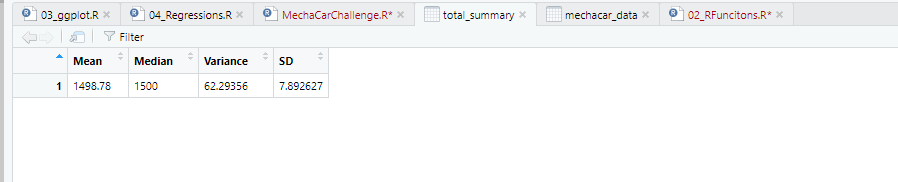
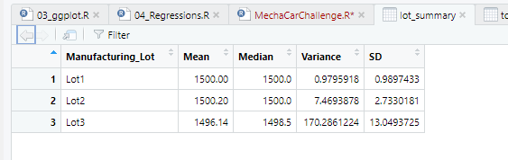
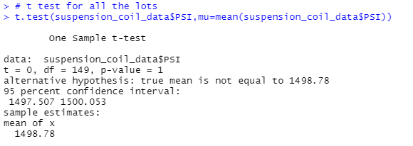
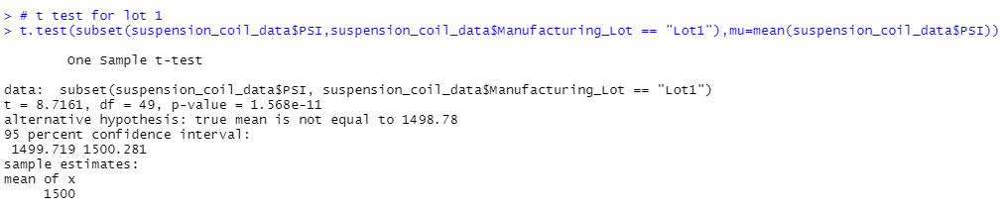
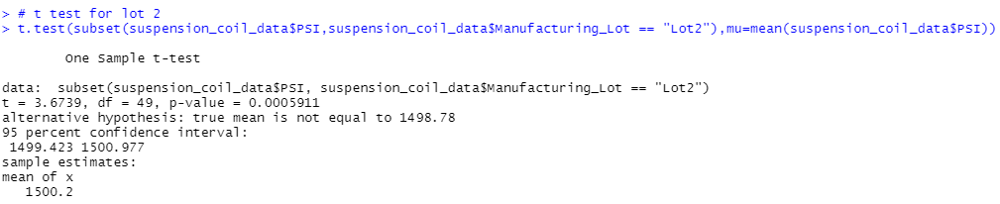
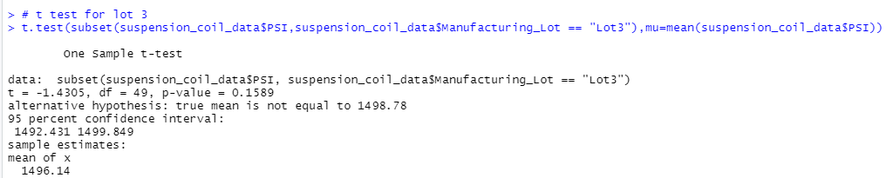

# MechaCar_Statistical_Analysis

## Linear Regression to Predict MPG

The dataset (mechacar_mpg) contains mpg results for 50 cars. These were used to get the optimal vehicle performance by considering the mpg mertic. Using Multiple Linear Regression
we were trying to predict the mpg by considering different variables.

### A. Linear Regression

### B. Summary of Linear Regression
Based on the below screenshot the p value of the spolier angle, vehicle weight and awd variables are having > 0.05 pvalues, which helps us to fail to reject null hypothesis and the other two variables vehicle Length and ground clearance has very negligile p value which means these variables are not effecting the mpg.

### C. Predictions for Linear Regression

1. spolier angle, vehicle weight and awd variables effects the mpg values in the dataset because the pr(>|t|) value is greater than 0.05. which helps to fail to reject the null hypothesis.
1. Slope of the linear model is not considered to be zero because all the variables/coefficients are directly proportional to the mpg vales.
1. The linear model does not predict mpg of MechaCar prototypes effectively because the p value of the multiple linear regression is 5.35e-11 which is higher than 0.05 and is not signficant.

## Summary Statistics on Suspension Coils

The Suspension_Coil.csv dataset contains the observations frmo ultiple production lots. In this dataset, the weight capacities of multiple suspension coils were tested to determine if the manufacturing process is consistent across production lots.

### A. The suspension coil’s PSI continuous variable across all manufacturing lots
The total_summary in the below table shows the mean, median, variance and SD for the PSI for suspension coil across all manugacturing units, and the variance of the suspension coil is under 100 PSI.

### B. The following PSI metrics for each lot: mean, median, variance, and standard deviation.
The lot_summary in the below table shows the mean,median, variance and SD for the PSI for suspension coil across all manufacturing units individually. Looking at the table we can see the variance of Lot3 is higher than 100 PSI which is not acceptable.

  

The design specifications for the MechaCar suspension coils dictates that the variance of the suspension coils must not exceed 100 pounds per square inch. The current manufacturing data meets this design specification for all manufacturing lots in total which is below 100 PSI.But when we look at the lots individually we can see that Lot3 has PSI higher than 100.

## t-Tests on Suspension Coils

We will perform t-tests to determine if all manufacturing lots and each lot individually are statistically different from the population mean of 1,500 pounds per square inch.

A. To Determine if the PSI across all manufacturing lots is statistically different from the population mean of 1,500 pounds per square inch.
The p value is 1 which is greater than 0.05 and is therfore not significant and the null hypothesis can be accepted

B. To Determine if the PSI for each manufacturing lot is statistically different from the population mean of 1,500 pounds per square inch.

1. Lot 1
The p value is 1.568e-11 which is greater than 0.05 and is therfore not significant and the null hypothesis can be accepted.

2. Lot 2
The p value is 0.0005911 which is less than 0.05 and is therfore significant so the null hypothesis can be rejected.

3. Lot 3
The p value is 0.1589 which is greater than 0.05 and is therfore not significant so the null hypothesis can be accepted

Looking at the p value for all the manufacturing lots together is greater than 0.05 and is not significant so the null hypothesis can be accepted.Similarly the null hypothesis for lot1 and lot 3 can also be accepted as the p values are also greater that 0.05. The null hypothesis for lot2 can be rejected as the p value is less than 0.05

## Study Design: MechaCar vs Competition
The various comparable factors that MechaCar can perform against the competition would be cost, Hwy fuel efficiency, horse power (hp), maintenance cost,seating capacity,PSI, mpg,ground clearence,fuel type,safety rating etc.

1. We can test the highway fuel efficiency,horse power and cost.Since these metrics are directly proportional we can justify the cost of vehicle comparing to the competition.
1. The null hypothesis is a statement of no difference between a sample mean or population mean. The alternative hypothesis is a contradictory to the null hypothesis.The mean of metricA from the MechaCar can be equal or different than the mean of metricA from the competitor. Using the t test we can calculate the p value and depending on this p value we can reject our null hypothesis if p value is smaller than 0.05 and support the alternative hypothesis or accept the null hypothesis and reject the alternative hypothesis.
1. Since we are comparing the means from two populations we can use two sample t test. Further as we want to know whether one population mean is greater than or less than the other, we can perform a one-tailed t-test.
1. The following data is needed to run the statistical test
	a. The mean of both samples
	b. The standard deviation of both samples
	c. The number of observations.
	d. Boxplots will be compare the fuel effiency.

